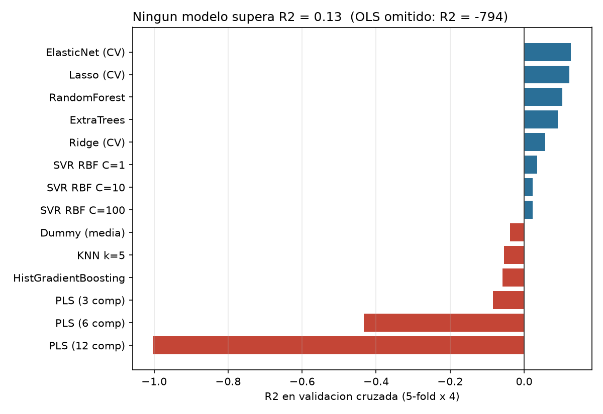

# pKi-Predictor

Predicción de pKi experimental a partir de descriptores de docking (gnina) para una
serie congenérica de 201 compuestos (`MB###`), dockeados contra dos estructuras del
mismo blanco (PDB `8Y..` y `7F..`).

Este repo documenta el diagnóstico de por qué la regresión múltiple no funcionó,
un benchmark reproducible de arquitecturas alternativas, y las líneas de trabajo
propuestas (incluido transfer learning) para mejorar la predicción.

## Datos

`data/all_8Yvs7F_mix_pKi.xlsx` — 201 filas, 178 columnas:

- `Compound`: identificador (`MB###`)
- 40 descriptores gnina por estructura, sufijo `_8Y` y `_7F` (afinidad, CNN score/affinity,
  términos de energía, geometría de residuos del bolsillo — χ1/χ2, distancias, shifts)
- `Dif_*` (40 cols): diferencia `8Y − 7F` de cada descriptor
- `Rel_*` (56 cols): versión reescalada/trigonométrica (sin/cos de los ángulos χ) de lo mismo
- `Experimental pKi`: variable objetivo (rango 5.0–10.6, media 7.58, sd 1.17)

No hay ningún descriptor propio del **ligando** (peso molecular, logP, TPSA,
fingerprints, etc.) — todo lo disponible describe la pose de docking.

## Resumen del diagnóstico

**La regresión múltiple no falló por elegir mal el modelo: falló porque los datos
no admiten ese ajuste.**

1. **p ≈ n con colinealidad exacta.** 176 descriptores para 201 muestras. Peor
   aún, 36 de las 40 columnas `Dif_*` son *exactamente* `8Y − 7F` (correlación
   > 0.999 con la resta) y `Rel_*` es una reexpresión de las mismas cantidades.
   No es multicolinealidad "alta": es dependencia lineal exacta entre bloques.
   Un OLS sobre las 175 columnas da **R² = −794** en validación cruzada — está
   memorizando ruido, no generalizando.
2. **Dimensionalidad efectiva alta.** Se necesitan ~39 componentes para explicar
   el 90% de la varianza de la matriz (rango numérico ≈ 135). No hay una
   estructura de baja dimensión fácil de capturar con pocos parámetros.
3. **Señal univariante débil.** Ningún descriptor individual pasa de |r| = 0.43
   con el pKi (`Dif_gauss_total`, R² ≈ 0.19 solo). Apenas 10 de 175 descriptores
   superan |r| > 0.3. Los scores nativos de gnina tampoco discriminan bien:
   `CNN affinity_7F` r = 0.35, `Affinity_7F` r = −0.01.

Esto es consistente con la limitación conocida de las funciones de scoring de
docking: están entrenadas/diseñadas para discriminar **pose** (¿esta conformación
es físicamente razonable?), no para ordenar **afinidad** entre ligandos de una
serie congenérica. Cambiar de familia de modelo no puede extraer señal que la
matriz de entrada no contiene.

## Benchmark

`scripts/02_benchmark.py` compara 15 modelos (lineales regularizados, PLS, SVR,
KNN, Random Forest, Extra Trees, Histogram Gradient Boosting) sobre 4 subconjuntos
de columnas, con **validación cruzada 5-fold repetida 4 veces** (misma partición
para todos los modelos, sin fuga de información: los `(CV)` ajustan su
regularización únicamente dentro del fold de entrenamiento).

Mejor resultado global — `ElasticNet` sobre las 175 columnas:

| Modelo | R² | MAE | r (Pearson) |
|---|---|---|---|
| ElasticNet (CV) | **0.126** | 0.90 | 0.43 |
| Lasso (CV) | 0.122 | 0.90 | 0.42 |
| Random Forest | 0.103 | 0.89 | 0.38 |
| Extra Trees | 0.092 | 0.89 | 0.37 |
| Ridge (CV) | 0.057 | 0.92 | 0.36 |
| Dummy (predice la media) | −0.038 | 1.00 | 0.00 |
| OLS sin regularizar | −794 | 5.33 | 0.09 |



Tabla completa en [`results/benchmark.csv`](results/benchmark.csv) (incluye los
4 subconjuntos de features probados). Detalle de la señal univariante en
[`results/univariate_correlations.csv`](results/univariate_correlations.csv).

**Conclusión del benchmark:** con esta matriz, el techo realista está en
R² ≈ 0.12–0.13 (MAE ≈ 0.90, casi igual al de predecir la media con sd = 1.17).
Ningún cambio de arquitectura por sí solo va a mover esto de forma sustancial.

## Reproducir

```bash
pip install -r requirements.txt
python scripts/01_diagnostics.py   # redundancia, dimensionalidad, correlaciones univariantes
python scripts/02_benchmark.py     # benchmark de modelos + figura
```

## Próximos pasos propuestos (por impacto esperado)

1. **Incorporar descriptores del ligando (la intervención de mayor impacto).**
   A partir de los SMILES de los 201 compuestos: descriptores RDKit (~200,
   incluye logP, TPSA, HBD/HBA, flexibilidad) + fingerprints ECFP4/FCFP6.
   En series congenéricas de este tamaño esto suele mover el R² a 0.5–0.7,
   porque en una serie congenérica la variación de pKi está dominada por la
   química del ligando, no solo por cómo encaja en el bolsillo.

2. **Transfer learning** (requiere estructura 2D del ligando):
   - Pre-entrenar sobre datos de ChEMBL para el mismo blanco y hacer
     fine-tuning con las 201 moléculas, si existen suficientes pKi publicados
     para esta diana.
   - Embeddings congelados de un modelo preentrenado en química general
     (ChemBERTa-2, MolFormer-XL) + cabeza simple (Ridge/GP) encima — con
     n=201, congelar el encoder es más razonable que fine-tuning completo.
   - **Chemprop** (D-MPNN) usando los descriptores de docking existentes como
     *extra features* del grafo molecular: es el enfoque estándar para
     combinar estructura 2D con descriptores de docking en datasets pequeños.

3. **Δ-learning:** en vez de predecir pKi directamente, modelar el residuo
   `pKi − CNN_affinity`. Barato de probar, puede ayudar si el score base tiene
   algo de señal sistemática que solo hace falta corregir.

4. **Ensemble de poses**, si se guardó más de una pose por ligando: usar
   estadísticas sobre el ensemble (o pesado tipo Boltzmann) en vez de solo la
   mejor pose, que descarta información.

5. **Validación por scaffold/clúster**, no aleatoria, una vez haya estructuras:
   en una serie congenérica la CV aleatoria sobreestima la capacidad de
   generalización a compuestos realmente nuevos.

Este repo se deja preparado (`scripts/common.py`) para añadir estos pasos:
`feature_sets()` ya separa los bloques de la matriz actual, y la carga de datos
está aislada de los scripts de análisis para poder enchufar nuevas columnas
(descriptores de ligando) sin reescribir el benchmark.
